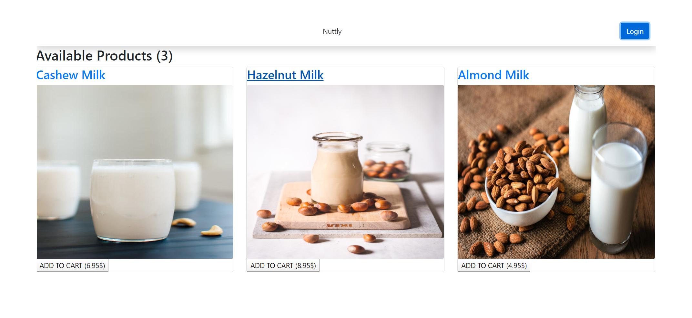

# Nuttly App
A Full-stack Mern based app that makes shoping with Snip-Cart, along with Mongo, Mongoose and bootstrap-react. 

## Why do a shopping App? 
Remember in the old days of setting out milk jugs to be refilled. Nuttly is bringing it back with the aid of modern technology. However we will be doing nut-milk (ie. cashews, peanuts, macadamia nuts, pecans and hazelnut milk and other nut milks.) These are great for cooking and protein shakes. Most store bought, nut-based-milks are water down to get calorie count and fat way down these nut-milks are full fat and not waterdown to allow max nutrition. 

## Team Roles
Jordan - Project Leader
Jon      - Presentation and Project Director
Eric      - Database
Anna   - Designer

## The Plan

Admin Flow: See/edit all users  ||  See deliveries on a certain date
- Create the models
	- Users
	- Products
	
- Create API
- Wireframe website
	- Welcome page
	- Product info pages
	- User account management
	- Deliveries by date
	- All user overview
- React Components
	- Product info
	- New user account form	
	- Deliveries table

**Chanllenges**
Ate too much White Castle!!!
Utilizing CSS Frameworks with React
Modals
Routes after deployment
Adobe Xd

## How to install 
Clone Repo
Navigate to server.js folder and "npm install" to install the required dependencies.
Navigate to root directory and "yarn start" to start client.
Create your own DataBase at MongoDB.com
Open Command Line and start MongoDB by typing "mongod"
Open Command Line and start second Mongo by typing "mongo" (different editions)

this is a milk based shopping app that allows users to sign in and order milk through snipcart. 
view it in action here http://lit-crag-95157.herokuapp.com/

Take a look at my Portfolio Page
https://jonfinley211.github.io/portfolio/

